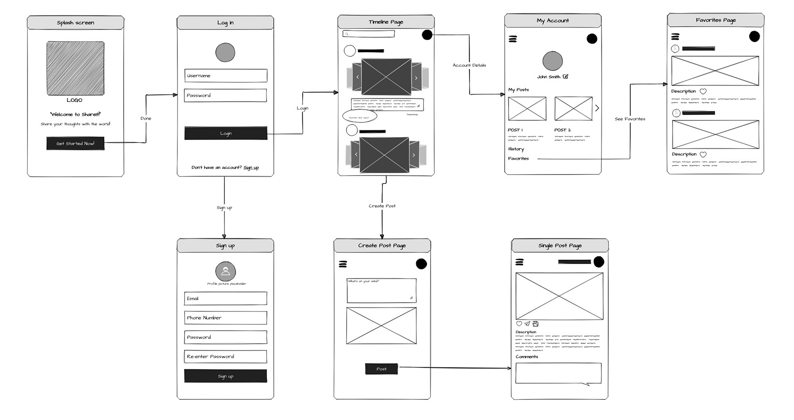

# ShareIt: Mobile App Wireframe & User Flow

This repository contains the user flow and wireframes for **ShareIt**, a mobile social application designed to help users share their thoughts and experiences with the world.

## User Flow Diagram

The diagram below illustrates the complete user journey, from initial onboarding to core application features like creating posts, browsing the timeline, and managing personal account details.

## Key Screens & Functionality

The application flow is broken down into three main parts: Onboarding, Core Experience, and Account Management.

### 1. Onboarding & Authentication

* **Splash Screen**: The initial screen that greets the user, displaying the app logo and a tagline. A "Get Started Now!" button prompts the user to begin the authentication process.
* **Sign Up Page**: New users can create an account by providing their email, phone number, and a password. This screen includes fields for password confirmation and a profile picture placeholder.
* **Log In Page**: Existing users can access their accounts using their username and password. A link is also provided for new users to navigate to the Sign Up page.

### 2. Core Application Experience

* **Timeline Page**: This is the main feed where users can view posts from others. It features a scrolling list of content, a navigation menu (hamburger icon), and a primary call-to-action to create a new post.
* **Create Post Page**: Accessed from the Timeline, this screen allows users to compose their thoughts, upload an image, and publish it to their feed.
* **Single Post Page**: This view shows a post in full detail, including the user who posted it, the full description, and interaction icons (like, comment, share). It also features a dedicated section for viewing and adding comments.

### 3. Account Management

* **My Account Page**: Accessible from the main navigation menu, this page serves as the user's profile hub. It displays their name and profile picture and provides links to view their own posts, their activity history, and their saved/favorited posts.
* **Favorites Page**: This screen displays a collection of all the posts the user has marked as a "favorite." It's a curated list for easy access to content they enjoy.
